# Daily Reflection Tree — Visual Diagram

```mermaid
flowchart TD
    START([🌙 START\nGood evening...]) --> A1_OPEN

    A1_OPEN{{"🌤 A1_OPEN\nWeather report for today?"}}
    A1_OPEN -- Sunny / Cloudy --> A1_D1
    A1_OPEN -- Stormy / Foggy --> A1_D1

    A1_D1{Decision:\nPositive or Difficult Day?}
    A1_D1 -- Positive --> A1_Q_AGENCY_HIGH
    A1_D1 -- Difficult --> A1_Q_AGENCY_LOW

    A1_Q_AGENCY_HIGH{{"❓ When things went well,\nwhat drove it?"}}
    A1_Q_AGENCY_HIGH -- Prepared / Flexible → internal --> A1_R_INT
    A1_Q_AGENCY_HIGH -- People / Luck → external --> A1_R_MID

    A1_Q_AGENCY_LOW{{"❓ When things got hard,\nwhat was your instinct?"}}
    A1_Q_AGENCY_LOW -- Find control / Push → internal --> A1_R_INT
    A1_Q_AGENCY_LOW -- Wait / Frustrated others → external --> A1_R_EXT

    A1_R_INT["💬 Reflection:\nYou stayed in the driver's seat."]
    A1_R_EXT["💬 Reflection:\nSomewhere today, you made a call."]
    A1_R_MID["💬 Reflection:\nYou're holding both — honest."]

    A1_R_INT --> A1_Q2_FOLLOWUP
    A1_R_EXT --> A1_Q2_FOLLOWUP
    A1_R_MID --> A1_Q2_FOLLOWUP

    A1_Q2_FOLLOWUP{{"❓ If today repeated,\nwhat would you change?"}}
    A1_Q2_FOLLOWUP -- Prepare/React/Communicate → internal --> BRIDGE_1_2
    A1_Q2_FOLLOWUP -- Not sure → external --> BRIDGE_1_2

    BRIDGE_1_2(["🔀 BRIDGE 1→2\nNow let's look at what you gave."])
    BRIDGE_1_2 --> A2_OPEN

    A2_OPEN{{"🌤 A2_OPEN\nEnergy going into key interaction?"}}
    A2_OPEN -- Help other --> A2_D1
    A2_OPEN -- Be recognized / Track return --> A2_D1
    A2_OPEN -- Get it done --> A2_D1

    A2_D1{Decision:\nContribution or Entitlement signal?}
    A2_D1 -- Help other --> A2_Q_CONTRIB_HIGH
    A2_D1 -- Recognition / Return --> A2_Q_ENTITLE_HIGH
    A2_D1 -- Get done --> A2_Q_CONTRIB_MID

    A2_Q_CONTRIB_HIGH{{"❓ Did you do something\nbeyond your responsibility?"}}
    A2_Q_CONTRIB_HIGH -- Picked up / Helped --> A2_R_CONTRIB
    A2_Q_CONTRIB_HIGH -- Stayed in lane / Thought not acted --> A2_R_MID

    A2_Q_CONTRIB_MID{{"❓ Texture of 'getting it done' —\nwhat were you tracking?"}}
    A2_Q_CONTRIB_MID -- Useful to other / Both --> A2_R_CONTRIB
    A2_Q_CONTRIB_MID -- Credited / Clear list --> A2_R_ENTITLE

    A2_Q_ENTITLE_HIGH{{"❓ Did you get the recognition\nyou were tracking?"}}
    A2_Q_ENTITLE_HIGH -- Yes fair / Stopped tracking --> A2_R_CONTRIB
    A2_Q_ENTITLE_HIGH -- Partly / No frustrated --> A2_R_ENTITLE

    A2_R_CONTRIB["💬 Reflection:\nYou gave without counting."]
    A2_R_ENTITLE["💬 Reflection:\nThe ledger is exhausting."]
    A2_R_MID2["💬 Reflection:\nBoth motives coexist."]

    A2_R_CONTRIB --> A2_Q2
    A2_R_ENTITLE --> A2_Q2
    A2_R_MID2 --> A2_Q2

    A2_Q2{{"❓ How would a colleague describe\nyour presence today?"}}
    A2_Q2 -- Showed up fully --> BRIDGE_2_3
    A2_Q2 -- Competent/distant/preoccupied --> BRIDGE_2_3

    BRIDGE_2_3(["🔀 BRIDGE 2→3\nNow — how wide was your lens?"])
    BRIDGE_2_3 --> A3_OPEN

    A3_OPEN{{"🌤 A3_OPEN\nYour challenge today — whose frame?"}}
    A3_OPEN -- Just me --> A3_D1
    A3_OPEN -- My team --> A3_D1
    A3_OPEN -- Colleague / End users --> A3_D1

    A3_D1{Decision:\nSelf or Other frame?}
    A3_D1 -- Just me --> A3_Q_SELF
    A3_D1 -- My team --> A3_Q_TEAM
    A3_D1 -- Colleague/Users --> A3_Q_ALTRO

    A3_Q_SELF{{"❓ Was there a moment you thought\nabout impact on others?"}}
    A3_Q_TEAM{{"❓ Did awareness of team\nchange how you acted?"}}
    A3_Q_ALTRO{{"❓ What did you do with\nthat awareness of others?"}}

    A3_Q_SELF -- Noticed ripple --> A3_R_TRANSCEND
    A3_Q_SELF -- Briefly / After --> A3_R_MID3
    A3_Q_SELF -- No --> A3_R_SELF

    A3_Q_TEAM -- Took extra / Checked in --> A3_R_TRANSCEND
    A3_Q_TEAM -- Aware not changed / Added stress --> A3_R_MID3

    A3_Q_ALTRO -- Acted / Felt unsure --> A3_R_TRANSCEND
    A3_Q_ALTRO -- Internal only / Background --> A3_R_MID3

    A3_R_TRANSCEND["💬 Reflection:\nYou held more than yourself."]
    A3_R_SELF["💬 Reflection:\nThe frame narrows under pressure."]
    A3_R_MID3["💬 Reflection:\nAwareness without action still counts."]

    A3_R_TRANSCEND --> A3_Q2
    A3_R_SELF --> A3_Q2
    A3_R_MID3 --> A3_Q2

    A3_Q2{{"❓ If today added up to something\nbeyond tasks — what?"}}
    A3_Q2 -- Made easier / Moved forward --> A3_R_TRANSCEND_CLOSE
    A3_Q2 -- Maintenance / Not sure --> SUMMARY_D

    A3_R_TRANSCEND_CLOSE["💬 Reflection:\nToday added up to something."]
    A3_R_TRANSCEND_CLOSE --> SUMMARY_D

    SUMMARY_D{Decision:\nPath archetype?}
    SUMMARY_D -- Victor + Contrib + Altro --> SUMMARY_VCA
    SUMMARY_D -- External + Entitle + Self --> SUMMARY_EES
    SUMMARY_D -- Internal + Entitle mix --> SUMMARY_ICM
    SUMMARY_D -- Default mixed path --> SUMMARY_DEFAULT

    SUMMARY_VCA["📋 Summary: Full day —\nAgency, Giving, Widened lens."]
    SUMMARY_EES["📋 Summary: Hard day —\nBut you named it honestly."]
    SUMMARY_ICM["📋 Summary: Strong agency,\nquieter contribution."]
    SUMMARY_DEFAULT["📋 Summary: Mixed path —\nWhat moment stays with you?"]

    SUMMARY_VCA --> END
    SUMMARY_EES --> END
    SUMMARY_ICM --> END
    SUMMARY_DEFAULT --> END

    END([🌙 END\nRest well.])
```

## Legend

| Symbol | Meaning |
|--------|---------|
| 🌙 Rounded rectangle | Start / End nodes |
| 🌤 Double hexagon | Question nodes (employee picks an option) |
| Rectangle | Decision nodes (invisible routing) |
| 💬 Rectangle | Reflection nodes (employee reads, clicks continue) |
| 🔀 Stadium shape | Bridge nodes (axis transitions) |
| 📋 Rectangle | Summary nodes |

## Path Summary

The tree has **4 primary paths** through the summary:
- **VCA** (Victor + Contribution + Altrocentric): Full day, agency + giving + widened lens  
- **EES** (External + Entitlement + Selfcentric): Reactive day — acknowledged honestly  
- **ICM** (Internal + Contribution mix): Strong execution, quieter giving  
- **DEFAULT**: Mixed signals — open-ended closing question
